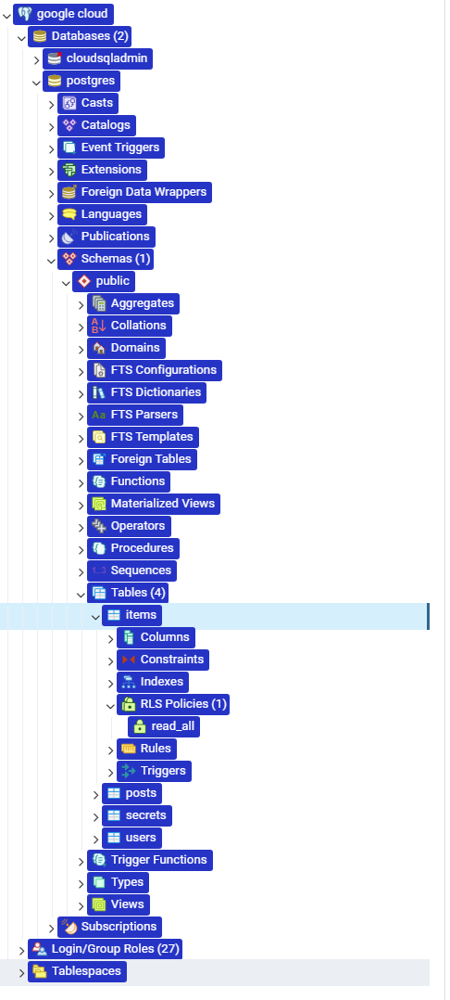
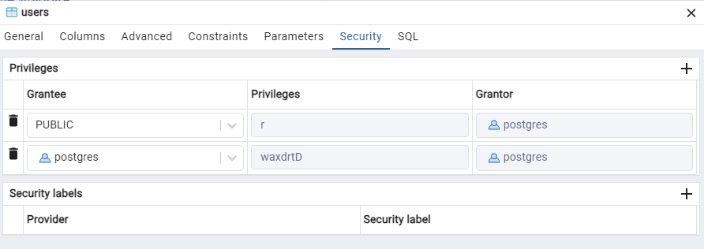
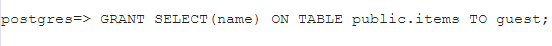

# Database docs

## Database prof of deployment

## Stucture

- pgAdmin  

- user table grantees

- User guest access to items table.

## Pros and cons for database choice

### Mysql
Using MySQL with granular access control provides several benefits and drawbacks. Here are the pros and cons:

**Pros:**

1. **Enhanced Security**: Granular access control allows you to define specific permissions for each user or role, reducing the risk of unauthorized access to sensitive data or functionalities.

2. **Fine-Grained Control**: You can precisely control what actions users can perform on databases, tables, or even specific rows or columns, ensuring that each user has only the necessary level of access.

3. **Isolation of Responsibilities**: By assigning different access levels based on roles or responsibilities, you can prevent accidental or intentional misuse of data by limiting access to only what is required for each user's job function.

4. **Audit Trail**: Granular access control allows for better tracking of user activities, making it easier to monitor who accessed what data and when, which is essential for security audits and compliance reporting.

**Cons:**

1. **Complexity**: Implementing and managing granular access control can be complex, especially in large databases with numerous users and roles. It requires careful planning and ongoing maintenance to ensure permissions are properly configured and updated as needed.

2. **Performance Overhead**: Fine-grained access control may introduce some performance overhead, especially when dealing with complex permission checks for every database operation. This overhead can impact query execution times, particularly in high-traffic environments.

3. **Potential for Errors**: With granular access control, there's a higher risk of misconfigurations or human errors that could lead to unintended access restrictions or security vulnerabilities. Regular auditing and testing are necessary to identify and rectify any issues.

4. **Increased Administration Effort**: Managing a large number of users, roles, and permissions can be time-consuming and require dedicated administrative resources. Proper documentation and training are essential to ensure consistency and accuracy in access control configurations.

5. **Compatibility Challenges**: Some applications or frameworks may not fully support granular access control features provided by MySQL, which could lead to compatibility issues or limited functionality when integrating with such systems.

### Postgresql

**Pros:**

1. **Enhanced Security**: Granular access control in PostgreSQL allows for fine-grained control over database objects, providing a high level of security by restricting access to sensitive data and functionalities based on user roles and permissions.

2. **Flexible Permission Management**: PostgreSQL offers a robust and flexible permission management system, allowing administrators to define detailed access controls at the database, schema, table, column, and even row levels, catering to diverse security requirements.

3. **Compliance Support**: PostgreSQL's granular access control capabilities aid organizations in meeting compliance requirements such as GDPR, HIPAA, or PCI DSS by enabling them to enforce strict access controls and audit user activities effectively.

4. **Isolation of Responsibilities**: By assigning specific privileges to roles or users, PostgreSQL helps maintain the principle of least privilege, ensuring that users have access only to the data and operations necessary for their roles, thereby reducing the risk of unauthorized access or misuse.

5. **Auditability**: PostgreSQL's granular access controls facilitate comprehensive auditing of database activities, allowing administrators to track user interactions, monitor access patterns, and investigate security incidents effectively, which is crucial for maintaining accountability and compliance.

**Cons:**

1. **Complexity**: Implementing and managing granular access control in PostgreSQL can be complex, especially in environments with numerous users, roles, and intricate permission requirements. Administrators must invest time and effort in planning, configuring, and maintaining access controls to ensure consistency and security.

2. **Performance Overhead**: Fine-grained access controls may introduce some performance overhead, particularly in scenarios involving complex permission checks for database operations. This overhead could impact query execution times, especially in high-throughput environments, necessitating careful optimization and resource management.

3. **Administration Overhead**: Managing granular access control configurations in PostgreSQL requires ongoing administration, including regular reviews, updates, and auditing of permissions to align with evolving security requirements and organizational changes, which may entail significant administrative effort and resources.

4. **Potential for Misconfiguration**: Granular access control configurations in PostgreSQL are susceptible to misconfigurations or errors, which could inadvertently grant excessive privileges or expose sensitive data, posing security risks. Thorough testing, documentation, and adherence to best practices are essential to mitigate such risks effectively.

5. **Compatibility Considerations**: Some applications or frameworks may not fully support PostgreSQL's granular access control features, leading to compatibility issues or limitations in functionality when integrating with such systems. Administrators should assess compatibility requirements and consider alternative solutions or workarounds as necessary.

### MongoDB

**Pros:**

1. **Enhanced Security**: Granular access control in MongoDB allows administrators to define specific permissions for users or roles, reducing the risk of unauthorized access to sensitive data or operations.

2. **Flexible Permission Management**: MongoDB's role-based access control (RBAC) system provides flexibility in defining permissions at the database, collection, or even field level, allowing for fine-grained access control tailored to the needs of different users or applications.

3. **Scalability**: MongoDB's granular access control mechanisms are designed to scale with the database, enabling organizations to manage access controls effectively across large and distributed environments without sacrificing performance.

4. **Compliance Support**: MongoDB's granular access control features help organizations comply with regulatory requirements such as GDPR, HIPAA, or PCI DSS by enforcing strict access controls, auditing user activities, and ensuring data protection and privacy.

**Cons:**

1. **Complexity**: Implementing and managing granular access control in MongoDB can be complex, especially in environments with diverse user roles, complex permission requirements, or large datasets. Administrators need to invest time and effort in planning, configuring, and maintaining access controls to ensure effectiveness and security.

2. **Performance Overhead**: Fine-grained access control operations in MongoDB may introduce some performance overhead, particularly in scenarios involving complex permission checks for database operations. This overhead could impact query execution times, especially in high-throughput environments, necessitating careful optimization and resource management.

3. **Administration Overhead**: Managing granular access control configurations in MongoDB requires ongoing administration, including regular reviews, updates, and auditing of permissions to align with evolving security requirements and organizational changes, which may entail significant administrative effort and resources.

4. **Potential for Misconfiguration**: Granular access control configurations in MongoDB are susceptible to misconfigurations or errors, which could inadvertently grant excessive privileges or expose sensitive data, posing security risks. Thorough testing, documentation, and adherence to best practices are essential to mitigate such risks effectively.

5. **Compatibility Considerations**: Some applications or frameworks may not fully support MongoDB's granular access control features, leading to compatibility issues or limitations in functionality when integrating with such systems. Administrators should assess compatibility requirements and consider alternative solutions or workarounds as necessary.

### Comparison
**MySQL:**

1. **Access Control Model**: MySQL traditionally uses a privilege-based access control model, where privileges are granted to users at the global, database, table, or column level. However, the granularity of access control is limited compared to other databases.
  
2. **Privilege Types**: MySQL provides standard privileges such as SELECT, INSERT, UPDATE, DELETE, as well as administrative privileges like CREATE, DROP, and GRANT. It also supports granting privileges to specific databases or tables.

3. **User Management**: MySQL manages users, roles, and permissions through its built-in authentication system. Users are granted permissions directly or through roles, but the level of granularity in permissions is not as fine as in some other systems.

**MongoDB:**

1. **Access Control Model**: MongoDB uses a role-based access control (RBAC) model, offering more flexibility and granularity in access control compared to MySQL. It allows administrators to define roles with specific privileges on databases, collections, and even individual documents or fields.

2. **Role-Based Access**: MongoDB allows the creation of custom roles with specific privileges, which can be assigned to users or applications. These roles can control access to CRUD operations, index management, and administrative actions.

3. **Integration with LDAP/AD**: MongoDB supports integration with LDAP or Active Directory (AD), allowing organizations to leverage existing identity management systems for user authentication and role assignment.

**PostgreSQL:**

1. **Access Control Model**: PostgreSQL provides a highly flexible and robust access control mechanism, offering fine-grained control over database objects. It supports an extensive range of privileges at the database, schema, table, column, and row levels.

2. **Role-Based Access**: PostgreSQL uses a role-based access control (RBAC) system similar to MongoDB, allowing administrators to define roles with specific permissions and assign them to users or other roles. Permissions can be granted at various levels of granularity.

3. **Row-Level Security (RLS)**: PostgreSQL offers advanced features like Row-Level Security (RLS), allowing administrators to restrict access to specific rows based on predefined policies. This feature is particularly useful for implementing complex access control requirements.

### Conclusion
In summary, while MySQL provides basic privilege-based access control, MongoDB and PostgreSQL offer more advanced role-based access control mechanisms with finer granularity. MongoDB excels in document-level and field-level access control, while PostgreSQL offers extensive flexibility with features like row-level security. The choice between these databases depends on specific security requirements, scalability needs, and the complexity of access control policies within your application or organization.