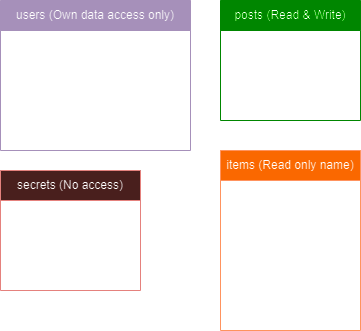

# Exposee

- Download postgresql: https://www.postgresql.org/download/
- Run this in the terminal: 
```
psql "sslmode=require hostaddr=34.159.194.199 user=guest dbname=postgres"
```
- Password:
```
GcCK60fKWJ'x
```

## Table access levels:
| Tables  | Permissions |
| ------------- | ------------- |
| users | Only access to own data  |
| items  | Read only column *name*  |
| posts  | Read and write all  |
| secrets  | No Access  |

### Diagram



## PostgresSQL query docs
Query guide: https://www.tutorialspoint.com/postgresql/index.htm

