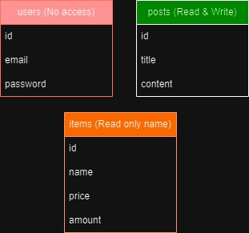

# Exposee

- Download postgresql: https://www.postgresql.org/download/
- Run this in the psql terminal: psql "sslmode=require hostaddr=34.159.194.199 user=guest dbname=postgres"
- Password: GcCK60fKWJ'x

## Table access:
users = No access 
items = Read only name 
posts = Read and write all 

