# Connection info Jeff repo
https://github.com/Geofery/System_Integration/blob/main/04b._%5BPair%5DDatabase_granular_access/README.md

# Walk thought
## Login
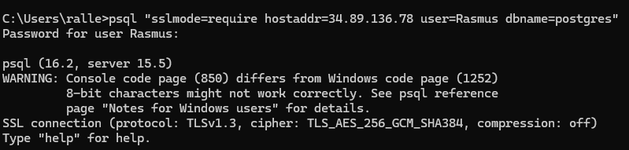

``psql "sslmode=require hostaddr=34.89.136.78 user=Rasmus dbname=postgres"``
``Rasmus1234``

## Tables
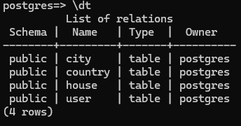

## Queries

  
City queries

  
### SELECT  
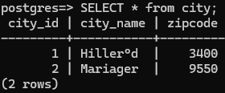

### INSERT
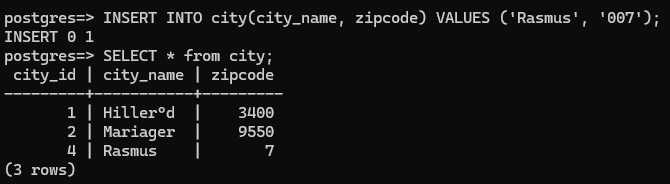

### UPDATE
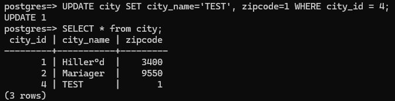

### DELETE
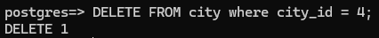

  
House queries

### SELECT
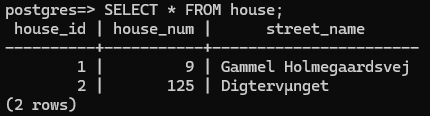
### INSERT
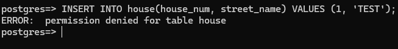
### UPDATE
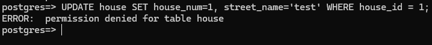
### DELETE
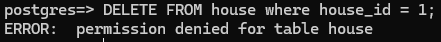

  
Country queries

  
### SELECT

### INSERT
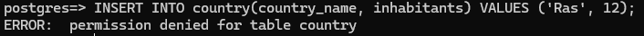
### UPDATE
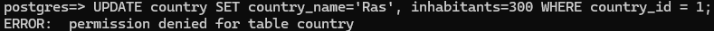
### DELETE
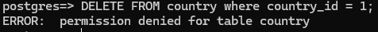

  
User queries

  
### SELECT
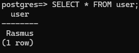
### INSERT
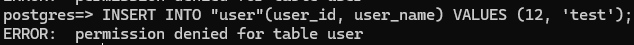
### UPDATE
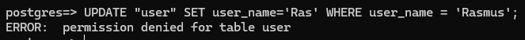
### DELETE
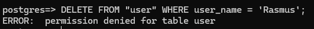

