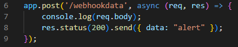

# Security Monitoring System (Webhook)

## Event Theme
- Security monitoring System

## Event Types

### Monitoring Alerts
- Monitoring alerts are for tracking various alert types, such as intruders, rapid increases in heat, and smoke.

### Monitoring Access
- Monitoring access is for tracking user access into the security system.

## User Guide

### Register Webhook

``To revice data from the webhook server, the users endpoint must be a post request.``
Example in nodejs with express:


To receive notifications for events, register a webhook with one of the following endpoints:

- **Alerts:**
  - Endpoint: `POST https://webhookappkea.azurewebsites.net/monitoring/alert`
  - Action: To add a webhook for alert events

- **Access:**
  - Endpoint: `POST https://webhookappkea.azurewebsites.net/monitoring/access`
  - Action: To add a webhook for access events

#### Exected data to be passed in the body

```json
{
    "url": "[your_endpoint]",
    "password": "[your_password]"
}
````

  ### Unregister Webhook

To unreceive notifications for events, unregister a webhook with one of the following endpoints:

- **Alerts:**
  - Endpoint: `DELETE https://webhookappkea.azurewebsites.net/monitoring/alert`
  - Action: To add a webhook for alert events

- **Access:**
  - Endpoint: `DELETE https://webhookappkea.azurewebsites.net/monitoring/access`
  - Action: To add a webhook for access events

#### Exected data to be passed in the body

```json
{
    "url": "[your_endpoint]",
    "password": "[your_password]"
}
````

### Other api functions

- **Ping:**
  - Endpoint: `GET https://webhookappkea.azurewebsites.net/monitoring/ping`
  - Action: To call all webhooks for testing
  - Description: This endpoint is for testing functionality of all webhooks


## API Endpoints Overview

| HTTP Verbs | Endpoints             | Action                                     |
|------------|-----------------------|--------------------------------------------|
| GET        | /monitoring/ping      | To call all webhooks for testing           |
| GET        | /monitoring/alert     | To retrieve all alert webhooks             |
| GET        | /monitoring/access    | To retrieve all access webhooks            |
|------------|-----------------------|--------------------------------------------|
| POST       | /monitoring/alert     | To add a webhook for alert events          |
| POST       | /monitoring/access    | To add a webhook for access events         |
|------------|-----------------------|--------------------------------------------|
| DELETE     | /monitoring/alert     | To delete a single webhook for alerts      |
| DELETE     | /monitoring/access    | To delete a single webhook for access      |