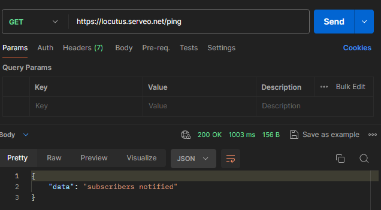
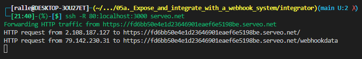
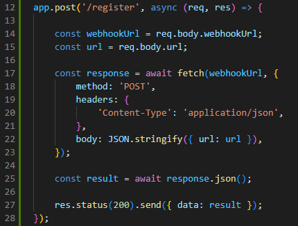
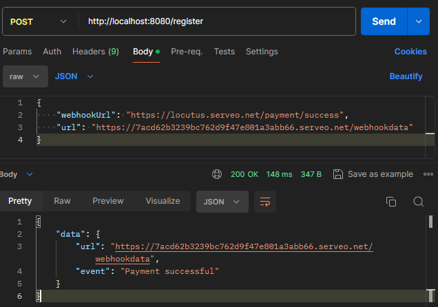
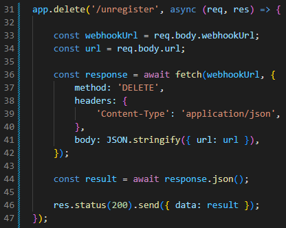
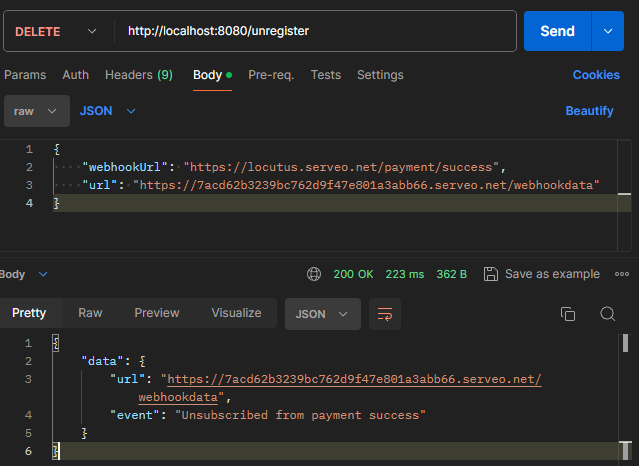
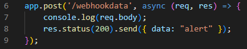

# Server part / client part

### Register webhook payment_success event:

### Response of the ping event:

### Serveo.net HTTP log

## Register
### Code

### Request

## Unregister
### Code

### Request

## Revice data from webhook
