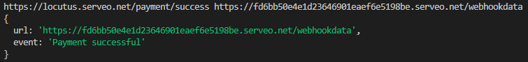

# Server part / client part

### Guide for client usage

## Endpoints

| Endpoint        | Method | Description                              |
|-----------------|--------|------------------------------------------|
| `/webhookdata`  | POST   | Receive webhook data                     |
| `/register`     | POST   | Register a webhook with a given URL      |
| `/unregister`   | DELETE | Unregister a webhook with a given URL    |

## Request and Response Formats

### `/webhookdata`

#### Request Body

The request body should contain the data associated with the webhook event.

#### Response

- Status: `200 OK`
- Body: Returns the received webhook data.

### `/register`

#### Request Body

- `webhookUrl`: String (required) - The URL of the webhook to register.
- `url`: String (required) - The URL to associate with the registered webhook.

#### Response

- Status: `200 OK`
- Body: Returns the response from the registered webhook.

### `/unregister`

#### Request Body

- `webhookUrl`: String (required) - The URL of the webhook to unregister.
- `url`: String (required) - The URL associated with the webhook to unregister.

#### Response

- Status: `200 OK`
- Body: Returns the response from the unregistered webhook.

## classmate webhook

### Register webhook payment_success event:

### Response of the ping event:

### Serveo.net HTTP log

## Register
### Code

### Request

## Unregister
### Code

### Request

## Revice data from webhook
