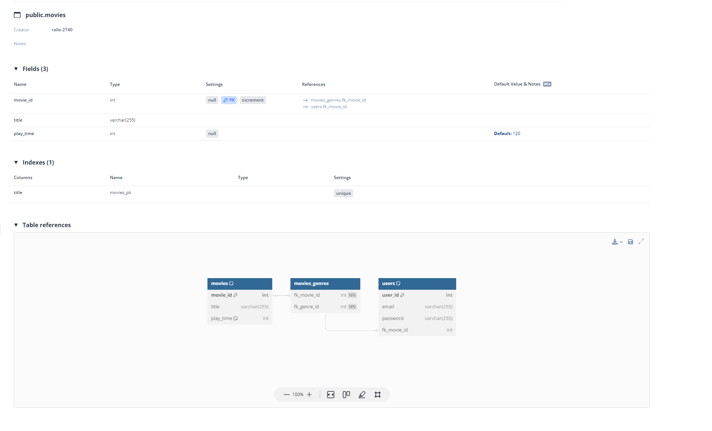
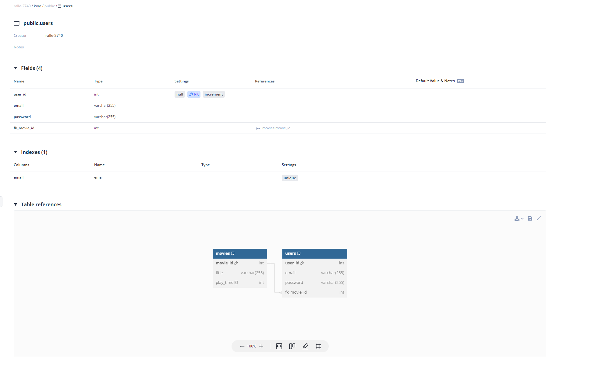

# Getting startet

## Tools

### dbdocs

``Install dbdocs first``
```` bash
    npm install -g dbdocs
````


- Tools using for database documentation: https://dbdocs.io/docs

### dbml/cli

``Install dbml/cli first``
```` bash
    npm install -g @dbml/cli
````

- Dosc: https://dbml.dbdiagram.io/cli/#installation

#### Convert a sql file to dbml

```` bash
    sql2dbml kino.sql --mysql -o kino.dbml
````

- Docs: https://dbml.dbdiagram.io/cli/#convert-a-sql-file-to-dbml


# Documentaion:





