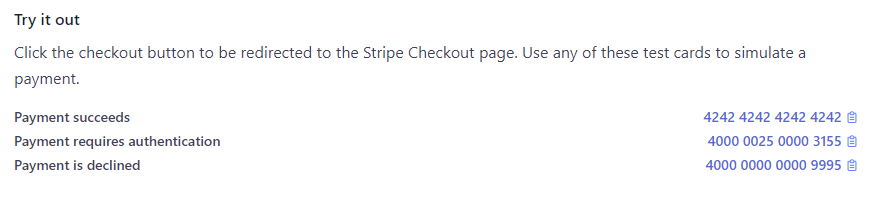

# Env setup
create a .env file with the options below
````
STRIPE_SECRET_KEY=sk_test_4RxUm8rtZ0phcTFLbHvkTJD5

CLIENT_URL=http://localhost:5500/00._Tasks/10._Web_Scraping_GraphQL/10b._Integrate_With_Payment/client/

PORT=3000
````


https://docs.stripe.com/checkout/quickstart?client=react&lang=node
